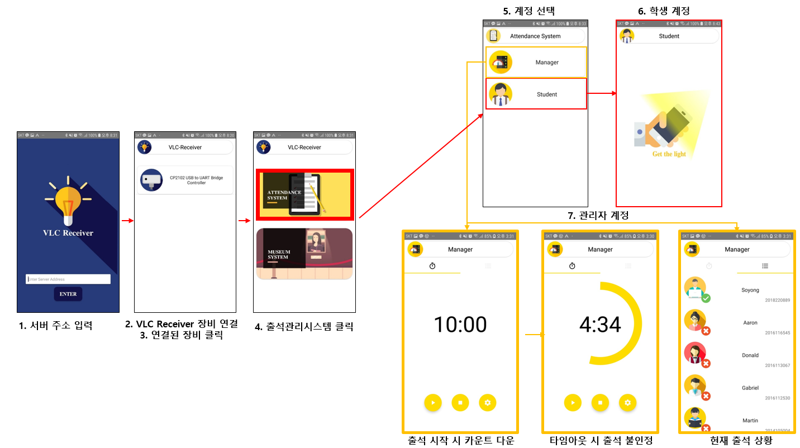
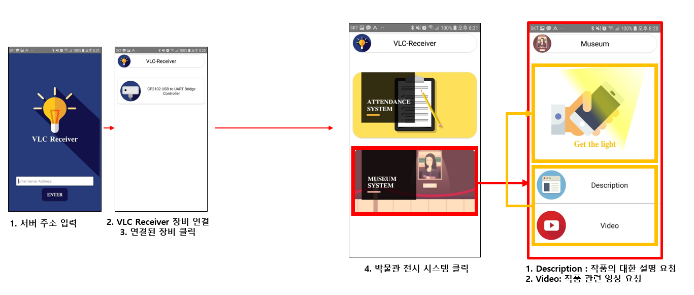

# VLC-AttendanceSystem


## 서버 설치

- 라즈베리파이 업데이트

```
# sudo apt-get update

# sudo apt-get upgrade
```


- nodejs 설치

```
# curl -sL https://deb.nodesource.com/setup_10.x | sudo -E bash -

# sudo apt-get install -y nodejs

# sudo apt-get install npm = 혹시나 npm이 안깔려있으면 설치
```


- mysql(= mariadb) 설치

1. mysql 설치

```
# sudo apt-get install mysql-server mysql-client
```

2. mysql root 비밀번호 설정
   - 안하면 모비우스에서 mysql로 접근을 할 수 없음.

```
# mysql

# use mysql

# update user set authentication_string=password('1111'), plugin="mysql_native_password" where user='root';
```

​	다하고 다시 mysql하면 접근 거부 메시지가 나오면 성공.

​	mysql로 재접근시 아래와 명령 사용

```
# mysql -p

패스워드 입력하라고 하면,
1111
```

3. AAserver/mobius 폴더로 이동 후 mobiusdb 등록

```
# mysql -p
# create database mobiusdb
# source mobiusdb.sql
```


- 필요 패키지 설치

AAServer 폴더로 가서

```
npm install
```


- 실행

```
화면에서 디버깅을 하고 싶으면 옵션추가
# export DEBUG=viip*

서버 실행
nodejs mobius
```


- 주의사항
  - 한 번에 2개의 VT만 USB로 연결 가능
  - VT 아이디가 0, 1로 구성되어 있음 (ex video_vt0.mp4)
  - 클라이언트 앱은 apk를 설치하거나, VLC-Receiver를 빌드하고 설치 


## VLC Receiver(클라이언트) 사용법

### 가시광 통신 출결 시스템




### 가시광 통신 박물관 시스템




* 자세한 사용법은 영상을 참조.

<video src="VLC-Demo-Video-Final.mp4"></video>

